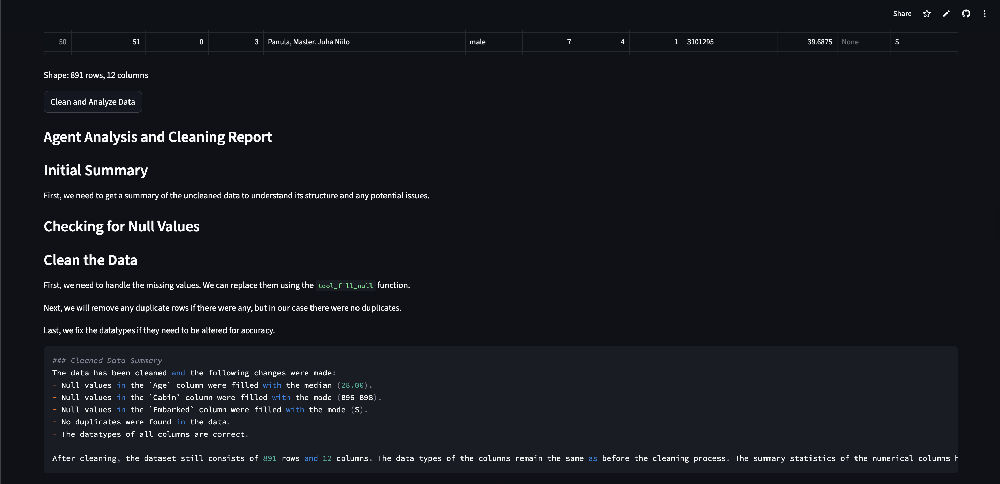

# CSV Data Cleaning & Visualization Agent

[Link](https://datacleaningvizagent-cc2rwp4m4gpcegctrpxadx.streamlit.app/)

## What it does
An AI-powered data cleaning and visualization agent that automatically analyzes, cleans, and visualizes CSV datasets. Upload any CSV file and the agent will detect issues, clean the data, explain every decision in plain English, and generate interactive visualizations.

## Features
- Automatic null value detection and filling (numerical with median, categorical with mode)
- Duplicate row detection and removal
- Datatype fixing for misformatted columns
- Outlier detection using IQR method
- Interactive visualizations (null heatmap, distributions, correlation heatmap, before/after comparison)
- AI-generated cleaning report explaining every decision
- Downloadable cleaned CSV

## Tech Stack
- Python
- Agno (AI agent framework)
- Groq (Llama 3.3 70B)
- Streamlit
- Pandas
- Plotly

## How to Run Locally
1. Clone the repo
2. Create a virtual environment: `python3 -m venv venv`
3. Activate it: `source venv/bin/activate`
4. Install dependencies: `pip install -r requirements.txt`
5. Create a `.env` file and add your Groq API key: `GROQ_API_KEY=your_key_here`
6. Run the app: `streamlit run app.py`

## Screenshot

